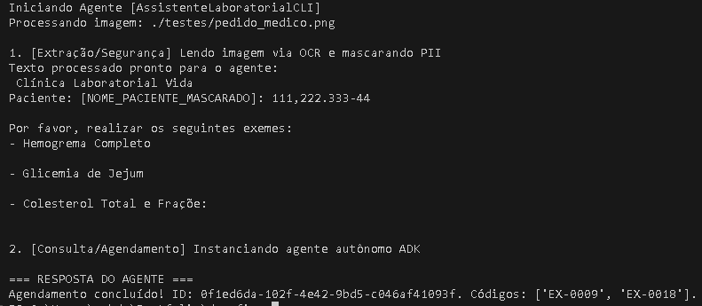
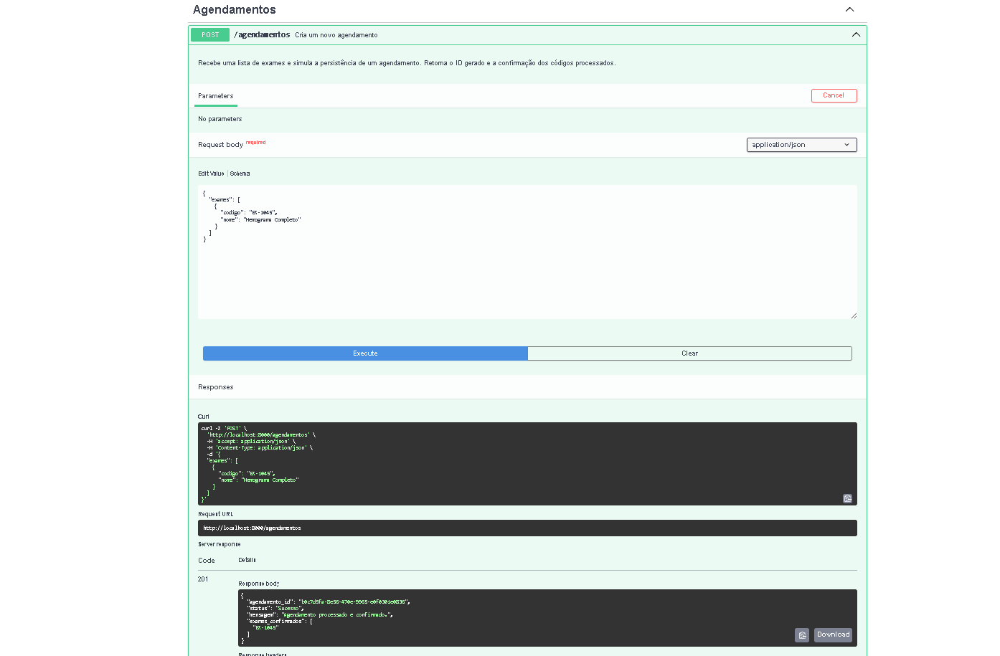

# Transpilador e Agente de Agendamento Médico: Solução do Desafio

Este repositório contém a solução completa para o desafio de inteligência artificial de desenvolvimento de um Transpilador.
O **Transpilador** recebe um JSON estruturado contendo a especificação (ferramentas configuradas de RAG, OCR, modelo do LLM e API de destino) de um Agente. Seu objetivo é tratar essas informações de forma **robusta e estrita** e, então, **gerar dinamicamente (`transpilar`) um código Python funcional de Inteligência Artificial**, focado exclusivamente na plataforma e boas práticas do **Google ADK**. 

O agente CLI produzido (o código final gerado) é encarregado de executar o agendamento de exames clínicos, operando com total autonomia o fluxo interativo e a proteção dos dados (sanitização de PII) numa interação com as seguintes tecnologias integradas:

## 🏗️ Arquitetura e Fluxo Tecnológico
- **Transpilador Robusto:** Criado com `pydantic` para validar a estrutura e campos do JSON base, levantando mensagens de erro verbosas antes da compilação, ao invés de aceitar as chaves "às cegas".
- **Motor do Agente:** Código gerado inteiramente orquestrado por componentes oficiais (`LlmAgent`, `App`, `Runner`, `McpToolset`, `FunctionTool`) da framework **Google ADK**.
- **Segurança Antecipada (Sanitização de PII):** O fluxo executa a leitura da OCR em etapa independente do LLM, passando o texto por uma malha para mascarar dados sensíveis (PII: Nomes, CPFs, Emails) e apenas entrega a matriz de texto higienizada como _prompt_ base, garantindo "zero vazamento" nas iterações do LLM para a internet ao procurar informações.
- **Protocolo de Integração:** Interações realizadas pelo Model Context Protocol (MCP) usando o padrão Server-Sent Events (SSE).
- **Microsserviços de Backend (Dockerizados)**:
  - **Servidor OCR (`/mcp-ocr`):** Instancição do MCP usando OpenCV, Tesseract e PyMuPDF para receber arquivos (como `pedido_medico.png`) e converter para texto bruto.
  - **Servidor RAG (`/mcp-rag`):** Serviço MCP acoplado nativamente na arquitetura do Agent do ADK capaz de buscar os códigos específicos laboratoriais correspondentes à lista de exames abstraída pelo LLM.
  - **API de Agendamento (`/api`):** Backend em **FastAPI** (`/agendamentos`) que confirma a geração do "número de protocolo" após receber o Payload.
- **Gestor de Dependências:** `uv` garantindo performance em ambientes simulado.

## 🚀 Como Executar o Projeto

Para processar o pipeline de ponta a ponta sem dor de cabeça, o projeto foi containerizado:

### 1. Iniciar a Infraestrutura (Dependências MCP e a API Backend)
O ambiente possui 3 micro-serviços responsáveis pelo OCR, RAG e FastApi rodando via docker-compose:
```bash
docker compose up --build -d
```
> Os containers estarão expostos nas portas locais `8000` (FastAPI), `8001` (MCP/OCR), e `8002` (MCP/RAG).

### 2. Instalar as Variáveis de Ambiente e Bibliotecas
Crie localmente (se ainda não preenchido no gerador) a sua chave de ambiente oficial:
Gere ou use o terminal configurando a flag `GEMINI_API_KEY`:

Instalação do ambiente local da execução transpilada:
```bash
uv sync
```

### 3. Rodar o Transpilador
Para verificar o Pydantic transformando a especificação JSON (que se encontra na pasta `transpiler/agente_config.json`) em código em `agente_gerado.py`:
```bash
uv run python transpiler/main.py
```
*Se as chaves estiverem incorretas ele levantará os erros, se passarem, o código Google ADK nascerá na mesma pasta.*

### 4. Executar o Agente Orquestrador
Use o arquivo emitido para processar o caso de teste local embutido (`testes/pedido_medico.png`):
```bash
uv run python transpiler/agente_gerado.py testes/pedido_medico.png
```

O agente cumprirá a extração OCR (capaz inclusive de transcrever notas manuscritas e receitas digitalizadas sem padrões), fará o bypass de Segurança (Guardrail PII escondendo dados dos pacientes), consultará os códigos internamente no LLM batendo no servidor MCP de RAG (base simulada dos códigos mapeados do laboratório Vida), e submeterá o protocolo final na interface do FastAPI para persistência.

## 📸 Demonstração da Execução

Abaixo, apresentamos os painéis demonstrando o funcionamento da arquitetura *End-to-End* (Ponta a Ponta):

### Logs do Terminal (Transpilação e Execução Completa)
Nesta execução, o roteiro extrai inteiramente a lista de exames da imagem-teste, isola de imediato os vestígios da identidade do paciente gerando um `NOME_PACIENTE_MASCARADO`, e inicia a execução sequencial orquestrada usando `google.adk.Runner` para obter os IDs por RAG e agendar no FastAPI sem inferência humana.



### Inspeção via Swagger (FastAPI Target)
Resultado da chamada do *Mock Backend* instanciado durante a finalização do processo (exposto dinamicamente após rodar a rede Docker na porta mapeada em `/docs`):
Aqui, validamos o roteiro REST de Agendamento, certificando que as integrações ADK FunctionTool estão repassando a formatação estrita do modelo Pydantic para a API.



---

### Link da conversa com a IA
Acompanhe os detalhamentos e as tomadas de decisões arquiteturais na conversa de concepção técnica com a assistência da dupla virtual:
[Gemini Share](https://gemini.google.com/share/052bad9fcd1c)